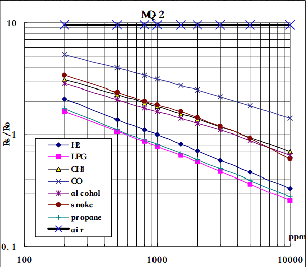
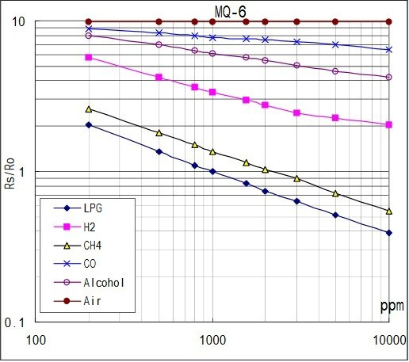
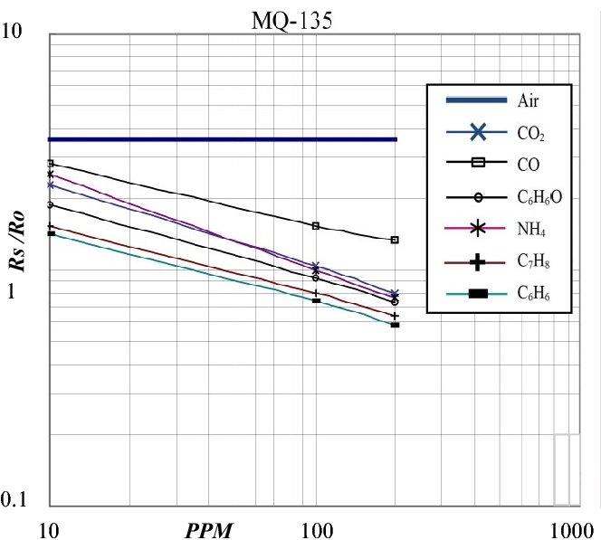

# GAS LEAKAGE DETECTION SYSTEM

### MATERIAL USED
- [x]  ARDUINO UNO R3
- [x] 16×2 LCD DISPLAY
- [x] MQ-2
- [x] MQ-135
- [x] MQ-6
- [x] 10K POTENTIOMETER
- [x] BREADBOARD

### WORKING 
In our proposed system, the whole device is controlled though
microcontroller that is Arduino UNO R3(ATMEGA-328)

- First of all, our microcontroller calibrates all the sensor so
that they perform well.
- Then sensor senses the value of gases in the air and
provide the value to our Arduino.

- Then our Arduino justifies and calculate all values into
PPM (Parts Per Million) and display the values through
16×2 LCD display

- Then our Arduino justifies that if whether any value is
increasing more than the average value. If that happens then our Arduino checks which gas has
more concentration in air than average concentration of
that gas. And provide us a alert that that a particular gas is
getting leaked by showing it in our computer.

### DATA SHEETS

### CIRCUIT DIAGRAM

### TESTING

### LEGAL NOTES
Don't use this project without giving me credits, this whole project was made for `Jawaharlal Nehru National Science Exhibition` when i was in 9th grade, it took a lots of efforts to develop this whole thing. 